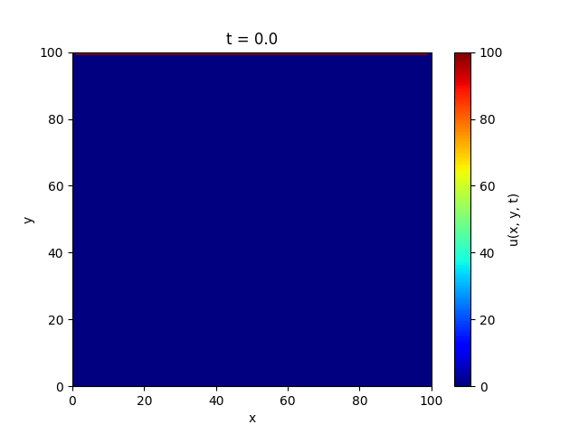
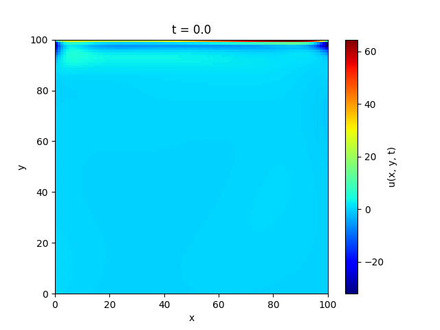

# 🔥 Heat Transfer Simulation using Physics-Informed Neural Networks (PINNs)

This repository demonstrates a **2D heat transfer simulation** using two approaches:  
1. **Finite Difference Method (FDM)** – a classical numerical solver.  
2. **Physics-Informed Neural Networks (PINNs)** – a deep learning method that embeds the PDE physics directly into training.  

The project compares **accuracy, speed, and flexibility** of both approaches and highlights the advantages of PINNs, including their ability to **discover unknown PDE parameters** such as the thermal diffusivity `α`.

---

## 📝 Problem Context (SITUATION)

Modeling **heat transfer in 2D domains** is a fundamental problem in engineering and physics.  
Traditionally, the **Finite Difference Method (FDM)** is used to solve the governing **heat equation PDE**:

$$
\frac{\partial u(x, y, t)}{\partial t} 
= \alpha \left( 
\frac{\partial^2 u(x, y, t)}{\partial x^2} +
\frac{\partial^2 u(x, y, t)}{\partial y^2}
\right)
$$

where `u(x, y, t)` is the temperature field and `α` is thermal diffusivity.  

- FDM requires discretizing the domain into a **grid**, which can be computationally expensive for large or high-resolution domains.  
- Additionally, solving PDEs using FDM can be slow when repeating simulations with varying boundary conditions.  

To address these challenges, **PINNs** were used: a deep learning framework that incorporates the PDE into the neural network loss function. PINNs allow **continuous solutions**, faster inference, and can even **learn PDE parameters**.

---

## 🎯 Objectives (TASK)

The main objectives of this project were:

1. **Implement 2D heat transfer simulation** using both FDM and PINNs.  
2. **Compare runtime and accuracy** between the two methods.  
3. **Visualize heat propagation** using animated GIFs.  
4. **Test PDE discovery capability** by learning the thermal diffusivity `α` directly from data.  
5. **Demonstrate scalability** of PINNs for future real-time or irregular-domain problems.

---

## 🛠️ Implementation (ACTION)

The project was implemented as follows:

### 🔹 Numerical Solver (FDM)
- Implemented in **`heat_solver.py`**.  
- Uses explicit finite difference discretization for 2D domains.  
- Solves the PDE step-by-step across a **uniform grid**.  

### 🔹 Physics-Informed Neural Network (PINNs)
- Implemented in **`pinn.py`**.  
- Inputs: `(x, y, t)` coordinates.  
- Outputs: temperature `u(x, y, t)`.  
- Loss function includes:
  - **PDE residual loss** (ensures solution satisfies heat equation).  
  - **Boundary condition loss** (top = 100°C, other sides = 0°C).  
  - **Initial condition loss** (uniform 0°C at t=0).  
  - **Data loss** (if sparse measurements are available).  

### 🔹 Collocation Point Strategy
- Used **Latin Hypercube Sampling (LHS)** for collocation points.  
- Ensures better coverage of the domain compared to uniform grids.  

### 🔹 Data Generation
- Implemented in **`data_generation.py`**.  
- Functions to generate collocation points, boundary points, and initial conditions.  

### 🔹 Visualization
- Animated plots generated in **`plotter.py`**.  
- Stored in `/plots` as `.gif` files for side-by-side comparison.  

### 🔹 Training & Testing
- Notebook: **`main.ipynb`** contains experiments and results.  
- Testing scripts in `/tests` validate both solvers.  

---

## 📊 Results (RESULTS)

### 🔹 Runtime Comparison

| Method | Runtime (s) | Relative Speedup |
|--------|-------------|------------------|
| FDM Solver | **9.06** | Baseline |
| PINN Inference | **0.29221** | ~31× faster |

- **Absolute difference:** `8.77 s` saved  
- **Relative speedup:** ≈ **31× faster**  
- **Percentage faster:** ≈ **96.8% faster**  

✅ Once trained, **PINNs infer results ~97% faster** than FDM.  

---

### 🔹 Visual Comparison

| Finite Difference Method | Physics-Informed Neural Network |
| :---: | :---: |
|  |  |

Additional PINN results:  
- PDE residual → `plots/pinn_prediction_pde.gif`  
- Collocation points → `plots/pinn_prediction_colloc.gif`  
- Data-driven prediction → `plots/pinn_prediction_data.gif`  
- Learned α → `plots/pinn_prediction_alpha.gif`  
- Relative error → `plots/pinn_relative_error.gif`  

---

### 🔹 Benefits of PINNs over FDM

1. **Speed** – Once trained, PINNs infer solutions ~97% faster than FDM.  
2. **Continuous Solutions** – PINNs approximate the temperature field across the **entire domain**, not just grid points.  
3. **Flexibility** – Work with **irregular geometries** and **sparse data**.  
4. **PDE Discovery** – PINNs can **learn unknown parameters** like thermal diffusivity `α`.  
5. **Data Assimilation** – PINNs can fuse physical equations with experimental data seamlessly.  

---

### References
[57 Physics Informed Neural Networks | Introduction | Inverse Methods in Heat Transfer](https://youtu.be/3KqTt7O_rnU)
[58 Physics Informed Neural Networks | An Intuitive Explanation | Inverse Methods in Heat Transfer](https://youtu.be/ORCZH4v1oVk)
[59 Physics Informed Neural Networks | BC Incorporation | Inverse Methods in Heat Transfer](https://youtu.be/REjzCl6UB-E)
[60 PINNs for Inverse Problems | Inverse Methods in Heat Transfer](https://youtu.be/6a9pWh22jjc)
[Special Thanks to nkusla](https://github.com/nkusla)

