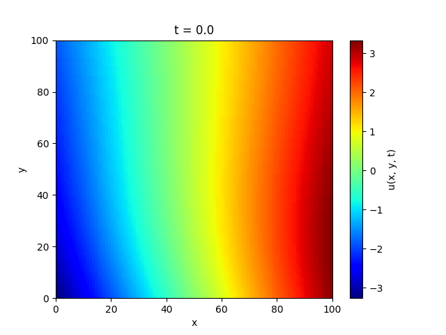
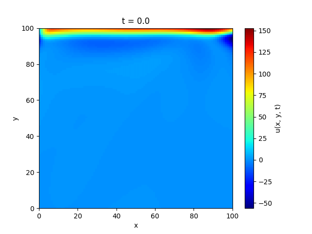
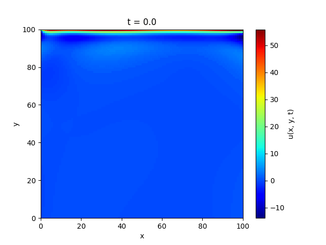
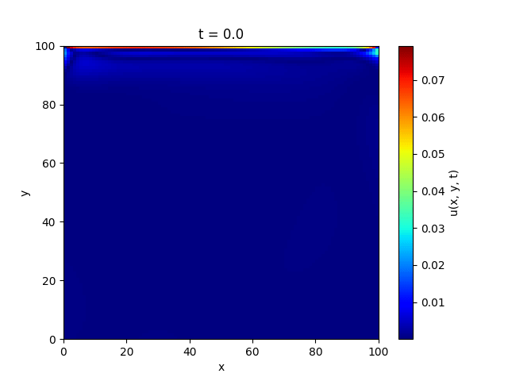

# 🔥 Simulation of 2D Heat Transfer using PINNs vs FDM

This project applies **Physics-Informed Neural Networks (PINNs)** to simulate **2D heat transfer**, and compares the performance with the traditional **Finite Difference Method (FDM)**.  

The study demonstrates PINNs’ ability to solve the **heat equation PDE** under given boundary and initial conditions, while also showcasing their potential for **PDE discovery** by identifying the unknown thermal diffusivity parameter \( \alpha \).  

---

## 📌 Motivation (STAR Method)

### **Situation**
Modeling heat transfer is critical in engineering, but classical solvers like **Finite Difference Method (FDM)** can be computationally expensive and limited to structured grids. With the rise of scientific machine learning, **PINNs** provide an alternative by embedding physical laws directly into neural networks.

### **Task**
- Simulate 2D heat propagation using both **FDM** and **PINNs**.  
- Compare **accuracy**, **efficiency**, and **scalability**.  
- Explore how PINNs can **discover PDE parameters** such as thermal diffusivity (\( \alpha \)).

### **Action**
- Built an **FDM solver** (`heat_solver.py`) for the heat equation.  
- Implemented a **PINN model** (`pinn.py`) that enforces PDE residuals, boundary conditions, and initial conditions through loss terms.  
- Used **Latin Hypercube Sampling (LHS)** (`data_generation.py`) to select collocation points across the spatio-temporal domain.  
- Ran controlled experiments and visualized results using **GIF animations** (`plots/`).  

### **Result**
- **FDM runtime:** `9.06 seconds` using `HeatSolver` class.  
- **PINN runtime (after training):** `0.29221 seconds` when predicting with the trained model.  
- PINNs provided smooth, continuous solutions while respecting physics constraints.  
- Successfully **discovered α** by minimizing PDE residuals.  

---

## ⚡ Results: FDM vs PINNs

| Finite Difference Method | Physics-Informed Neural Network |
| :---: | :---: |
|  |  |

Additional PINN visualizations:  

- **By PDE residual:**   
- **By boundary conditions:**   
- **By data points:**   
- **Parameter discovery (α):**   
- **Relative error analysis:**   

---

## 🛠️ Project Structure

